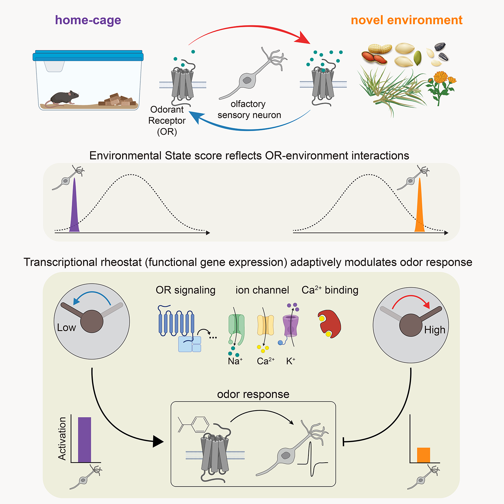

Tsukahara_Brann_OSN 
==============================

# A transcriptional rheostat couples past activity to future sensory responses

## Authors
Tatsuya Tsukahara¹*, David H. Brann¹*, Stan L. Pashkovski¹, Grigori Guitchounts¹, Thomas Bozza² and Sandeep Robert Datta¹

¹Department of Neurobiology, Harvard Medical School, Boston, MA 02115, USA\
²Department of Neurobiology, Northwestern University, Evanston, IL 60208, USA\
*These authors contributed equally

## Summary

Animals traversing different environments encounter both stable background stimuli and novel cues, which are thought to be detected by primary sensory neurons and then distinguished by downstream brain circuits. Here we show that each of the ~1000 olfactory sensory neuron (OSN) subtypes in the mouse harbors a distinct transcriptome whose content is precisely determined by interactions between its odorant receptor and the environment. This transcriptional variation is systematically organized to support sensory adaptation: expression levels of more than 70 genes relevant to transforming odors into spikes continuously vary across OSN subtypes, dynamically adjust to new environments over hours, and accurately predict acute OSN-specific odor responses. The sensory periphery therefore separates salient signals from predictable background via a transcriptional rheostat whose moment-to-moment state reflects the past and constrains the future; these findings suggest a general model in which structured transcriptional variation within a cell type reflects individual experience.

## Manuscript

For more details, please see our Open Access manuscript [here](https://www.cell.com/cell/fulltext/S0092-8674(21)01337-4).

# Installation

## Requirements
1. Make a new conda env, e.g. `conda create -n osn python=3.8`
2. Activate that env `conda activate osn`.
3. Clone and enter this repo: `git clone git@github.com:dattalab/Tsukahara_Brann_OSN.git && cd Tsukahara_Brann_OSN`
4. To install the specific versions of packages used in this repo do `pip install -r requirements.txt`. The minimal requirements for running the scripts and notebooks in this repo are to `pip install scanpy pysam numpy_groupies cmocean notebook`.
5. Install the code in this directory from the `setup.py` file via `pip install -e .`

## Data
1. Data is available on the NCBI GEO at Accession number [GSE173947](https://www.ncbi.nlm.nih.gov/geo/query/acc.cgi?acc=GSE173947).
2. Raw count files are provided for the mature OSNs for the 152 replicates used, grouped by experiment as described in [GSE173947_Dataset_raw_file_names.csv](data/tables/GSE173947_Dataset_raw_file_names.csv), which can also be found on the GEO.
3. Download the gene expression matrix and corresponding metadata (e.g. GSE173947_home_cage_umi_counts.csv.gz and GSE173947_home_cage_metadata.csv.gz for the home-cage dataset) to the [data/raw](data/raw) folder. The examples in this repo use the `home_cage`, `ChronicOccl`, `ActSeq`, `ActSeq_conc_analog`, and `env_switch` datasets. Therefore, to run these notebooks, the raw counts and metadata for these five experiments should be added to the [data/raw](data/raw) folder.
4. Alternatively, run `python scripts/download_geo.py` to download the supplementary files from the GEO.
5. The code and additional data files (such as extracted glomerular calcium traces) are hosted on Zenodo:

6. The raw fastq files (generated from the 10x bam files) can be found on the SRA (accession SRP318630). These were further processed, as described in the methods, to remove ambiguously-mapped UMIs, using the [run_dedup.sh](./scripts/run_dedup.sh) script. 

# Examples
Code to replicate analyses in [Tsukahara, Brann et al. 2021 Cell](https://www.cell.com/cell/fulltext/S0092-8674(21)01337-4). 

1. Open a new jupyter notebook with `jupyter notebook`.
2. Run the [notebooks](./notebooks). The first notebook ([00_make_adata_from_raw_counts.ipynb](./notebooks/00_make_adata_from_raw_counts.ipynb)) converts the raw count matrices into AnnData objects used for downstream analyses. The subsequent notebooks show how to apply the cNMF gene loadings to get gene expression program (GEP) usages, how to identify activated ORs and calculate the activation score in the Act-seq experiments, and how to work with the data from the other experimental manipulations (e.g. environment switches).
3. Run any of the stand-alone [scripts](./scripts). These perform classification of OR identity from the scRNA-seq data, as well classification of environment and odors from the imaging data. Some of these require more computing resources. The results shown in the paper are typically after 1,000 restarts, though the defaults in this repo use fewer.

# Contact
For more details, please consult the methods in our manuscript, post an issue here, or contact the authors.